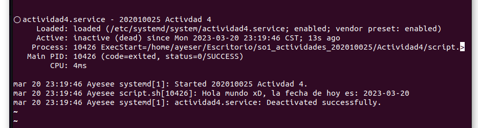

# Universidad de San Carlos de Guatemala
# Sistemas Operativos 1, Actividad 4
## Ayeser Cristián Oxlaj Juárez - 202010025

# Actividad 4
Crear un systemd unit de tipo servicio para ejecutar un script que imprima un saludo y la fecha actual.

# Pasos para realizar la actividad
1. Se creó un scrip sencillo que saluda y da la fecha actual.
```python
#!/bin/bash
fecha_actual=$(date +"%Y-%m-%d")
echo "Hola mundo xD, la fecha de hoy es: $fecha_actual"
```
2. Le otorgamos permisos al script creado.
```python
chmod 777 script.sh
```
3. Ahora ingresamos a la siguiente dirección para crear un systemd unit de tipo servicio.
```python
cd /etc/systemd/system/
```
4. Creamos un archivo con extensión .service con el siguiente comando
```python
touch actividad4.service
```
5. Ahora escribimos en el archivo, para ello podemos usar `sudo nano actividad4.service` o bien como se realizo usuando Visual Code `code actividad4.service`.
6. Escribimos las siguientes instrucciones en el archivo actividad4.
```python
[Unit]
Description= 202010025 Activdad 4 

[Service]
User=ayeser
ExecStart=/home/ayeser/Escritorio/so1_actividades_202010025/Actividad4/script.sh
[Install]
WantedBy=multi-user.target
```
Donde :
 
- Description: Podemos escribir lo que queramos.
- User: el usuario del sistema operativo que ejecutará el daemon
- ExecStart: Indica la ruta absoluta (no funcionan relativas) al script.
- WantedBy: directivas de uso y otras dependencias.

7. Recargamos los servidores para incluir el nuevo archivo.
```
sudo systemctl daemon-reload  
```
8. Habilitamos el servidor que hemos creado (Ya no es necesario hacerlo en la ruta donde se creo).
```
sudo systemctl enable actividad4.service   
```
9. Ahora se inicia el servidor, con lo cual hacemos que se ejecute el script.
```
sudo systemctl start actividad4.service  
```
10. Verificamos el estado del servidor para ver si se ejecuta correctamente.
```
sudo systemctl status actividad4.service    
```


11. Por último si deseamos detener el servidor, podemos usar el siguiente comando: 
```
sudo systemctl stop actividad4
```